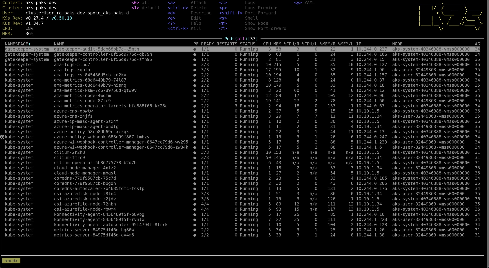

# AKS Enterprise Landing Zone

A learning and demo resource for exploring **private AKS** deployment on Azure, using a **hub-and-spoke** network topology with full egress control, no public IPs on workloads or VMs, and Terraform modules — following production best practices throughout.

Use this repo to understand Terraform concepts, Azure networking patterns, and enterprise-grade AKS architecture.

## Architecture

```
                 ┌──────────────────────────── Hub VNet (10.0.0.0/16) ────────────────────────────┐
                 │                                                                                  │
   Operator ──▶  │ ┌──────────────────────┐    ┌──────────────────────┐    ┌──────────────────────┐ │
   (browser)     │ │ AzureBastionSubnet   │    │ AzureFirewallSubnet  │    │ snet-shared          │ │
                 │ │  Azure Bastion       │    │  Azure Firewall      │    │  (future shared svc) │ │
                 │ └──────────┬───────────┘    └──────────┬───────────┘    └──────────────────────┘ │
                 │            │                            │                                          │
                 └────────────┼────────────────────────────┼──────────────────────────────────────────┘
                              │ VNet peering               │ forced egress (UDR)
                              ▼                            │
                 ┌──────────────────────────── Spoke VNet (10.10.0.0/16) ──────────────────────────┐
                 │                                                                                  │
                 │ ┌──────────────────────┐    ┌──────────────────────┐    ┌──────────────────────┐ │
                 │ │ snet-jumpbox         │    │ snet-aks             │    │ snet-pe              │ │
                 │ │   Linux VM (NIC only)│    │   AKS nodes          │    │   PE for ACR         │ │
                 │ │                      │    │   UDR → Firewall     │    │                      │ │
                 │ └──────────┬───────────┘    └─────────┬────────────┘    └──────────┬───────────┘ │
                 │            │ kubectl via              │ 0.0.0.0/0 → FW            │ private IP   │
                 │            │ private API IP           │ allowed FQDNs / ports      │              │
                 │            ▼                          ▼                             ▼              │
                 │  ┌────────────────────────────────────────────────────────────────────────────┐  │
                 │  │  Private DNS Zones (linked to hub + spoke VNets):                          │  │
                 │  │  • privatelink.<region>.azmk8s.io  → AKS private API endpoint              │  │
                 │  │  • privatelink.azurecr.io          → ACR private endpoint                  │  │
                 │  └────────────────────────────────────────────────────────────────────────────┘  │
                 └──────────────────────────────────────────────────────────────────────────────────┘
```

**What the current Terraform implementation deploys:**

| Component | Notes |
|---|---|
| Hub VNet + 3 subnets | Firewall, Bastion, shared services |
| Spoke VNet + 3 subnets | AKS nodes, private endpoints, jumpbox |
| Bidirectional VNet peerings | Hub ↔ spoke routing |
| **Azure Firewall (Standard)** + Firewall Policy | All cluster egress audited in one place |
| AKS-required firewall rules | Minimal FQDN/port allow-list (network + application rules) |
| Route table on `snet-aks` | UDR: `0.0.0.0/0` → Firewall private IP |
| **Azure Bastion (Standard SKU)** | Browser-based SSH to jumpbox — no public IPs needed |
| Private DNS Zones | Name resolution for AKS API + ACR over private network |
| **Private AKS cluster** | `private_cluster_enabled = true`, BYO DNS zone, user-assigned identity |
| User-assigned managed identity for AKS | Pre-granted Private DNS Zone Contributor + Network Contributor |
| **Premium ACR** with private endpoint | `public_network_access_enabled = false` — image pulls stay on-net |
| `AcrPull` on ACR for AKS kubelet | No registry secrets; MSI-based auth |
| AKS Azure Monitor metrics add-on | `monitor_metrics {}` enabled on AKS for AMA/managed Prometheus pipeline |
| Azure Monitor workspace + DCR association | Managed Prometheus workspace wired to AKS via DCR association |
| Managed Grafana (private) | Integrated with Monitor workspace via private endpoint and private DNS |
| Prometheus recording/alerting rules | Rule groups created in Azure Monitor for node/workload health |

## Module layout

```
.
├── main.tf            # Resource groups + 3-stage orchestration modules
├── variables.tf       # All input variables (with defaults)
├── outputs.tf         # Key resource IDs and connection info
├── providers.tf       # azurerm ~> 4.0, terraform >= 1.5.0
└── modules/
    ├── platform_stack/   # Stage 1: network, firewall, bastion, private DNS zones
    ├── core_stack/       # Stage 2: private AKS cluster
    ├── addons_stack/     # Stage 3: ACR, Prometheus/Grafana, rule groups, user node pools
    ├── hub_network/      # Building block modules used by platform_stack
    ├── firewall/
    ├── bastion/
    ├── spoke_network/
    ├── private_dns_zones/
    ├── private_aks/      # Building block module used by core_stack
    ├── private_acr/      # Building block modules used by addons_stack
    ├── managed_prometheus/
    ├── grafana/
    ├── recording_rules/
    └── alerting_rules/
```

Each module has `main.tf / variables.tf / outputs.tf / versions.tf` and can be consumed independently.

### Dependency chain

Terraform uses staged orchestration plus module output references:

```
platform_stack  ──▶  core_stack   ──▶  addons_stack
```

Inside each stage, ordering is primarily output-driven (with targeted `depends_on` only where Azure ordering is strict).

## Prerequisites

- [Terraform](https://developer.hashicorp.com/terraform/install) >= 1.5
- Azure CLI, authenticated:

  ```bash
  az login
  az account set --subscription "<your subscription id>"
  ```

## Environments

Three ready-to-use var files live under `envs/`. Each uses an isolated address
space so all three environments can exist in the same subscription simultaneously.

| File | Environment | Address spaces | AKS system pool | AKS user pool | Log retention |
|---|---|---|---|---|---|
| `envs/dev.tfvars` | `dev` | hub `10.0/16`, spoke `10.10/16` | D2s_v5 × 1–2 | D2s_v5 × 1–3 | 30 days |
| `envs/test.tfvars` | `test` | hub `10.1/16`, spoke `10.11/16` | D2s_v5 × 1–3 | D4s_v5 × 1–5 | 60 days |
| `envs/prod.tfvars` | `prod` | hub `10.2/16`, spoke `10.12/16` | D4s_v5 × 2–5 | D8s_v5 × 3–10 | 90 days |

Two variables are intentionally **not** in the var files because they are secret
or identity-specific:

| Variable | How to supply |
|---|---|
| `jumpbox_admin_password` | `export TF_VAR_jumpbox_admin_password='...'` |
| `windows_jumpbox_admin_password` | `export TF_VAR_windows_jumpbox_admin_password='...'` |
| `operator_object_id` | Optional. Defaults to the currently authenticated principal (`az login` identity). Override with `export TF_VAR_operator_object_id=$(az ad signed-in-user show --query id -o tsv)` |

## Usage

### Deploy to a specific environment

```bash
terraform init

# Set secrets once as env vars (never in var files)
export TF_VAR_jumpbox_admin_password='<a-strong-password>'
export TF_VAR_windows_jumpbox_admin_password='<a-strong-password>'
# operator_object_id is optional — omit to default to the logged-in principal
# export TF_VAR_operator_object_id=$(az ad signed-in-user show --query id -o tsv)

# Deploy dev
terraform apply -var-file=envs/dev.tfvars

# Deploy test
terraform apply -var-file=envs/test.tfvars

# Deploy prod (consider a separate state backend per env — see docs/enterprise-concepts.md)
terraform apply -var-file=envs/prod.tfvars
```

### Destroy an environment

```bash
terraform destroy -var-file=envs/dev.tfvars
```

### Separate state per environment (recommended for prod)

Configure a remote backend in `providers.tf` with a different state key per
environment. A common pattern uses the environment name as part of the blob path:

```hcl
backend "azurerm" {
  resource_group_name  = "rg-tfstate"
  storage_account_name = "sttfstate<org>"
  container_name       = "tfstate"
  key                  = "aks-landing-zone/<env>.tfstate"   # e.g. aks-landing-zone/prod.tfstate
}
```

Pass the key at init time: `terraform init -backend-config="key=aks-landing-zone/prod.tfstate"`

> ⚠️ **Cost warning.** This configuration provisions expensive Azure resources:
> Azure Firewall (~$900/mo), Bastion (~$140/mo), AKS control plane, Premium ACR, and public IPs.
> Always run `terraform destroy` when done experimenting.

## Connecting to the cluster

### Linux jumpbox (SSH via Bastion)

1. In the Azure portal, open the Linux jumpbox VM → **Connect → Bastion**.
2. Log in with `jumpbox_admin_username` / `jumpbox_admin_password`.
3. On the jumpbox:

   ```bash
   az login
   az aks get-credentials -g rg-paks-<env>-spoke -n aks-paks-<env>
   kubectl get nodes
   k9s
   ```

   The `kubectl` call resolves the private API FQDN to a **private IP** via the
   Private DNS Zone linked to the spoke VNet.

   

### Windows jumpbox (RDP via Bastion)

1. In the Azure portal, open the Windows jumpbox VM → **Connect → Bastion**.
2. Log in with `windows_jumpbox_admin_username` / `windows_jumpbox_admin_password`.
3. On first boot, the Custom Script Extension installs jumpbox tools via Chocolatey. Once complete, open a new PowerShell window and run:

   ```powershell
   az login
   az aks get-credentials -g rg-paks-<env>-spoke -n aks-paks-<env>
   kubectl get nodes
   helm version
   ```

4. To push an image:

   ```bash
   az acr build --registry <acr-name-from-outputs> --image <image>:<tag> .
   ```

### Jumpbox tooling installed by bootstrap

| Jumpbox | Installed tools |
|---|---|
| Linux jumpbox | Azure CLI, kubectl, kubelogin, Helm, Docker Engine/CLI, k9s |
| Windows jumpbox | Azure CLI, kubectl, kubelogin, Helm, git, Docker CLI, Headlamp |

## Why this design?

- **Private cluster** removes the public API endpoint — required by PCI, HIPAA, and most internal banking / finance security baselines.
- **BYO Private DNS zone** lets multiple spokes resolve the API name and gives Terraform full lifecycle ownership of the zone (auditable, versioned, destroyable).
- **User-assigned MI for AKS** is mandatory with a BYO DNS zone — AKS needs `Private DNS Zone Contributor` on the zone *before* the cluster is created.
- **Azure Firewall + UDR** centralises all egress through a single auditable point. AKS has a published list of required FQDNs and ports; this repo encodes them in a Firewall Policy.
- **Private ACR** prevents image exfiltration and external pull-through. The kubelet authenticates via MSI — no registry secrets in the cluster.
- **Staged orchestration (`platform → core → addons`)** gives predictable rollout sequencing for enterprise environments while keeping module boundaries reusable.

## Egress rules

AKS [requires specific egress](https://learn.microsoft.com/azure/aks/limit-egress-traffic). This repo implements a minimal allow-list in the Firewall Policy:

**Network rules**
- TCP/9000 to `AzureCloud.<region>` (tunnel front-end)
- UDP/1194 to `AzureCloud.<region>` (legacy tunnel)
- UDP/123 to `*` (NTP)
- TCP/443 to `AzureCloud.<region>`, `AzureMonitor`, `MicrosoftContainerRegistry`

**Application rules (HTTPS)**
- `AzureKubernetesService` FQDN tag (single line, covers the full official list)
- `mcr.microsoft.com`, `*.data.mcr.microsoft.com`, `*.cdn.mscr.io`
- `management.azure.com`, `login.microsoftonline.com`
- `packages.microsoft.com`, `acs-mirror.azureedge.net`
- `*.ods.opinsights.azure.com`, `*.oms.opinsights.azure.com`, `*.monitoring.azure.com`

## Further reading

- [`docs/enterprise-concepts.md`](docs/enterprise-concepts.md) — state strategy, module tiers, environments, identity, policy-as-code, drift, naming/tagging.
- [`docs/ci-cd-pipeline.md`](docs/ci-cd-pipeline.md) — reference GitHub Actions pipeline using Azure OIDC with plan-as-PR-comment and gated production apply.

## Recommended next steps

- Enable **Azure Policy add-on**, OIDC issuer, and Workload Identity in `modules/private_aks/main.tf` after baseline stability.
- Replace the jumpbox with **AKS Run Command** (`az aks command invoke`) for an even tighter perimeter.
- Add **Application Gateway (private IP)** or **NGINX Ingress** for inbound traffic.
- Add a second spoke for data services (SQL Managed Instance, Cosmos DB) and peer it through the hub.
- Enable **Workload Identity** on application pods to access Key Vault without secrets.
